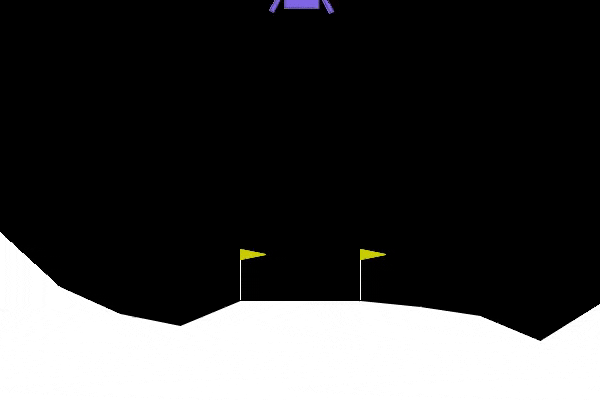

# Lunar Lander using Deep Q-Network (DQN)

  

This repository contains a solution for the **Lunar Lander** environment from OpenAI Gym, using **PyTorch** and **Deep Q-Networks (DQN)**. The goal of the project is to train an agent to safely land a spacecraft between two flags, using a reinforcement learning algorithm. 

In reinforcement learning, The agent learns by interacting with the environment, taking actions, and receiving rewards, ultimately improving its landing skills over time

## Features

This implementation utilizes a DQN model to approximate the Q-values for each action, in a continuous state space with discrete action control.

- **Deep Q-Network (DQN)** implementation using PyTorch.
- **Experience Replay** to store and sample previous transitions.
- **Target Network** to stabilize the learning process.
- **ε-greedy policy** for balancing exploration and exploitation.
- **Customizable hyperparameters** (learning rate, discount factor, batch size, etc.).

## Environment Details and Action Space

The environment used is **LunarLander-v2** from OpenAI Gym. The objective is to control a lunar lander to safely land between two flags without crashing. You can find the official page for the Lunar Lander environment [here](https://gymnasium.farama.org/environments/box2d/lunar_lander/).

### State Space:
The state is represented by an 8-dimensional vector, which includes:
- x, y coordinates of the lander.
- x, y velocities of the lander.
- Land angle and angular velocity.
- Contact with the left and right legs on the ground.

### Action Space:
The agent can choose from 4 discrete actions:
- **0**: Do nothing.
- **1**: Fire the main engine.
- **2**: Fire the left engine.
- **3**: Fire the right engine.

### Reward System:
- A large reward is granted for successfully landing between the flags.
- A small reward for each leg in contact with the ground.
- A negative reward for each second any of the engines are firing.
- A negative reward for crashing or flying away from the landing area.

## Model Details

The Deep Q-Network (DQN) is implemented using **PyTorch**. Key model components include:

- **Q-Network**: A neural network that estimates Q-values for each action based on the current state. It consists of:
    - Input layer: 8 units (corresponding to the state space).
    - Hidden layers: Fully connected layers with 128 and 64 units, using the ReLU activation function.
    - Output layer: 4 units (corresponding to the action space).
  
- **Target Network**: A copy of the Q-Network that is periodically updated to stabilize the learning process.

The model was trained over 500 episodes, periodically printing the average reward of the last 50 episodes. **AdamW** was used as the optimizer.

### Key Techniques:

- **Replay Memory**: The agent stores experiences (state, action, reward, next state, done) in a deque data structure. Random batches of experiences are sampled for training, which helps break correlations in data and stabilize learning.

- **ε-greedy Policy**: The agent selects random actions with a probability of ε, to explore the environment, and selects the best-known action otherwise.

## License
This project is licensed under the Apache 2.0 License - see the [LICENSE](LICENSE) file for details.
